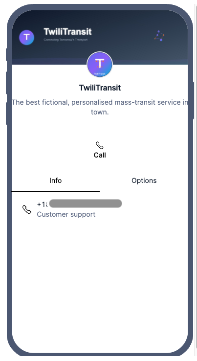

# Twilio Forge: Messaging Redefined - Workshop Runbook

## Pre-requisites

> [!IMPORTANT]  
> Please complete these steps prior to joining the workshop

1. [Node.js](https://nodejs.org/en) (current stable / LTS) installed on your machine  
2. A Twilio account with an SMS-capable phone number ([Sign up here](https://console.twilio.com/))
3. Go through the [RCS onboarding guide](https://www.twilio.com/docs/rcs/onboarding) and set up an RCS sender.
4. Your code editor of choice  
5. The [ngrok](https://ngrok.com/) tunneling service (or other tunneling service)
6. A modern smartphone with RCS capabilities for testing
7. Basic understanding of Twilio Messaging APIs and Messaging Services

## Workshop Overview

In this 60-minute hands-on lab, you'll build **TwiliTransit** - a multi-modal transportation assistant that guides passengers through a journey from TwiliTown to Signal City Market using RCS, while we talk of how other messaging channels like SMS or WhatsApp can be mixed in.

### What You'll Learn

- Set up and configure RCS messaging with Twilio
- Create rich content templates using the Content API
- Designing an Express.js backend for omnichannel communication
- Implement time-based triggers and interactive quick replies
- Handle dynamic channel fallback and route management

### The Journey We'll Build

Follow Alex's transportation journey with rich, contextual messaging at each step:

1. **Trip Planning** - Initial request and bus reminder setup
2. **Bus Boarding** - Real-time notifications with quick replies
3. **Ferry Transfer** - Location-aware notifications with QR codes
4. **Ferry Crossing** - Mid-journey engagement and next-step preparation
5. **Metro Connection** - Transfer guidance with rideshare options
6. **Journey Completion** - Trip summary and feedback collection

## Useful Links

* [RCS Rich Messaging Documentation](https://www.twilio.com/docs/messaging/channels/rcs)
* [RCS Onboarding Guide](https://www.twilio.com/docs/rcs/onboarding)
* [Messaging Services Documentation](https://www.twilio.com/docs/messaging/services)
* [RCS availability](https://www.twilio.com/docs/rcs/regional)
* [Assets to use (for demo purposes only)](https://forge-assets-5378.twil.io/index.html)

---

## Build

Let's start with the Build for the workshop.

### 2. Set Up RCS Sender and Messaging Service

> [!NOTE]
> This section runs through the [RCS Onboarding guide](https://www.twilio.com/docs/rcs/onboarding). If you already have an RCS Sender, a Messaging Service, and have assigned the RCS Sender to the Messaging Service, you may skip to the next section.

#### 2.1. Create RCS Sender

- Go to Twilio Console -> RCS -> [Senders](https://console.twilio.com/us1/develop/rcs/senders). Click "Create New Sender".
- Enter Sender Display Name: "TwiliTransit". Continue.
- On the next page:
    - Sender display name: `TwiliTransit`
    - Description: `The best fictional, personalised mass-transit service in town.`
    - Logo image: [Copy this URL](https://forge-assets-5378.twil.io/twilitransit/logo-224x224.png) (_Right click and copy link_), or download and host [`assets/logo-224x224.png`](assets/logo-224x224.png)
    - Banner image: [Copy this URL](https://forge-assets-5378.twil.io/twilitransit/banner-1440x448.jpg) (_Right click and copy link_), or download and host [`assets/banner-1440x448.jpg`](assets/banner-1440x448.jpg)
    - Accent color: Click color palette and add a color
    - Contact Details: Add your own contact information. Add suitable label. 
    - Privacy policy: [Copy this URL](https://forge-assets-5378.twil.io/twilitransit/privacy.md)(_Right click and copy link_), or download and host [`assets/privacy.md`](assets/privacy.md)
    - Terms of Service: [Copy this URL](https://forge-assets-5378.twil.io/twilitransit/tos.md) (_Right click and copy link_), or download and host [`assets/tos.md`](assets/tos.md)

You should see a preview that looks like this:



Click Next. **DO NOT submit the Sender for Carrier Approval.**

#### 2.2. Add device to test the RCS sender

After the Sender is added, go to the Sender settings -> Test -> "Add device to test this sender". If you have a phone with RCS enabled, add the number here.

You will receive an RCS message asking you to confirm that you want to be a tester. Accept that and we are good to go.

#### 2.3. Assign RCS Sender to Messaging Service

Create a Messaging service and assign RCS and SMS senders.

- Go to Twilio Console -> Messaging -> [Services](https://console.twilio.com/us1/develop/sms/services). Click "Create Messaging Service"
- Step 1: Create Messaging Service
    - Messaging service friendly name: `TwiliTransit Service`
    - Select what you want to use Messaging for: `Notify my users`
    - Next
- Step 2: Add Senders. Add two senders. One for SMS and another for RCS.
    - Sender Type: `Phone Number` -> Continue. Select Phone Number -> Add Phone Numbers.
    - Sender Type: `RCS Sender` -> Continue. Select the TwiliTransit RCS Sender. Add RCS Senders.
- Step 3: Set up integration
    - _Leave with default choice for now_
- Step 4: Add compliance info
    - Complete Messaging Service Setup

You should now have a Messaging service that supports a RCS sender with SMS fallback, ready to go!

> [!TIP]
> Try sending a message to your test device.

> [!IMPORTANT]
> **Add Messaging Service SID to our application**:  
> Copy the new Messaging Service SID (`MGxxxxxx...`) from the Messaging Services page.
> Add it to `.env` -> `MESSAGING_SERVICE_SID=""` line.

---

### 3. Create Content Templates Based on Journey Scenes

Our TwiliTransit journey follows 6 distinct scenes from Alex's trip. Let's create content templates for each:

**Scene Overview:**

1. **Trip Planning** - Alex decides to visit Signal City Market
2. **Bus Boarding** - Alex's reminder time arrives  
3. **Ferry Transfer** - Alex nears the ferry terminal
4. **Ferry Crossing** - Midway through the ferry ride
5. **Metro Connection** - Ferry arrives at Riverside Station
6. **Journey Completion** - Alex arrives at Signal City Market

**Go to Twilio Console -> Messaging -> [Content Template Builder](https://console.twilio.com/us1/develop/sms/content-template-builder).**

#### 3.1. Content Template 1: Trip Planning

**Create a new Content Template:**

- Template Name: `twilitransit_scene_1_trip_planning`
- Template Language: `English`
- Content Type: `Carousel`

> [!TIP]
> Now is a good time to quickly review all the [Content Types options](https://www.twilio.com/docs/content/content-types-overview) available. 

**Dynamic Fallback:** Click Edit dynamic fallback. Select "Text". Continue.

**Configure Content - Carousel:** In the "Carousel" tab:

**Body:**

```text
Hi {{1}}! Welcome to TwiliTransit! 🚎

Let's get you to {{2}}.
```

**Card 1:**

- Media URL: `https://forge-assets-5378.twil.io/twilitransit/{{3}}`
- Card Title: `Trip start`
- Card Body: `Your trip starts from {{4}}.`
- Button:
    - Type of Action: `Quick Reply`
    - Button text: `Remind me 5 mins before`
    - ID: `scene_1_reminder_bus`

**Card 2:**

- Media URL: `https://forge-assets-5378.twil.io/twilitransit/{{5}}`
- Card Title: `Trip end`
- Card Body: `Your trip ends at {{6}}.`
- Button:
    - Type of Action: `Quick Reply`
    - Button text: `Email me journey plan`
    - ID: `scene_1_email_journey`

**Text Fallback:** Switch to "Text" tab.

Body:

```text
Hi {{1}}! Welcome to TwiliTransit! 🚎

Let's get you to {{2}}.

Your trip starts from {{4}} and ends at {{6}}.

Reply with REMIND to get a reminder 5 mins before your bus arrives.

Reply with EMAIL to get the journey plan emailed to you instead.
```

---

#### Scene 1: Trip Planning Template

```javascript
// Scene 1: Trip Planning - Alex decides to visit Signal City Market
async function createTripPlanningTemplate() {
  const contentData = {
    friendly_name: "scene1_trip_planning",
    language: "en",
    variables: {
      "1": "Alex"
    },
    types: {
      "twilio/card": {
        title: "Hi {{1}}! 🚌 Welcome to TwiliTransit",
        body: "Let's help you get to Signal City Market. Your journey starts at Main St. Bus Stop. Would you like a reminder 5 minutes before the bus arrives?",
        actions: [
          {
            type: "reply",
            title: "Yes, remind me",
            payload: "REMIND_YES"
          },
          {
            type: "reply", 
            title: "No thanks",
            payload: "REMIND_NO"
          }
        ]
      },
      "twilio/text": {
        body: "Hi {{1}}! Welcome to TwiliTransit. Let's help you get to Signal City Market. Reply YES for bus reminders or NO to skip."
      }
    }
  };

  try {
    const response = await fetch('https://content.twilio.com/v1/Content', {
      method: 'POST',
      headers: {
        'Content-Type': 'application/json',
        'Authorization': `Basic ${Buffer.from(`${process.env.TWILIO_ACCOUNT_SID}:${process.env.TWILIO_AUTH_TOKEN}`).toString('base64')}`
      },
      body: JSON.stringify(contentData)
    });
    
    const responseData = await response.json();
    console.log('Scene 1 - Trip planning template created:', responseData.sid);
    return responseData.sid;
  } catch (error) {
    console.error('Error creating content template:', error.message);
  }
}
```

#### Scene 2: Bus Boarding Template

```javascript
// Scene 2: Bus Boarding - Alex's reminder time arrives
async function createBusReminderTemplate() {
  const contentData = {
    friendly_name: "scene2_bus_reminder",
    language: "en", 
    variables: {
      "1": "Alex",
      "2": "12",
      "3": "Bay 18"
    },
    types: {
      "twilio/card": {
        title: "🚌 Bus Alert for {{1}}",
        body: "Your bus (#{{2}}) is arriving in 5 minutes at {{3}}. Let us know when you arrive!",
        actions: [
          {
            type: "reply",
            title: "Yes, I'm here",
            payload: "ARRIVED_BUS"
          },
          {
            type: "reply",
            title: "No, I changed my plans",
            payload: "CHANGED_PLANS"
          },
          {
            type: "url",
            title: "View Map & Boarding Pass",
            url: "https://maps.google.com/?q=Main+St+Bus+Stop"
          }
        ]
      },
      "twilio/text": {
        body: "{{1}}, your bus (#{{2}}) arrives in 5 minutes at {{3}}. Reply 'Yes, I'm here' when you arrive or 'No, I changed my plans' if needed."
      }
    }
  };

  try {
    const response = await fetch('https://content.twilio.com/v1/Content', {
      method: 'POST',
      headers: {
        'Content-Type': 'application/json',
        'Authorization': `Basic ${Buffer.from(`${process.env.TWILIO_ACCOUNT_SID}:${process.env.TWILIO_AUTH_TOKEN}`).toString('base64')}`
      },
      body: JSON.stringify(contentData)
    });
    
    const responseData = await response.json();
    console.log('Scene 2 - Bus reminder template created:', responseData.sid);
    return responseData.sid;
  } catch (error) {
    console.error('Error creating content template:', error.message);
  }
}
```

### Step 4: Build the Webhook Handler

Add the main webhook endpoint to handle incoming messages:

```javascript
// Store user sessions and journey state
const userSessions = new Map();

// Content template SIDs - These will be populated when templates are created
const CONTENT_SIDS = {
  // Scene 1: Trip Planning
  tripPlanning: null,
  
  // Scene 2: Bus Boarding
  busReminder: null,
  
  // Scene 3: Ferry Transfer
  ferryTransfer: null,
  
  // Scene 4: Ferry Crossing
  ferryWelcome: null,
  
  // Scene 5: Metro Connection
  metroConnection: null,
  
  // Scene 6: Journey Completion
  journeyComplete: null
};

app.post('/webhook', async (req, res) => {
  const { From, Body, MessageSid } = req.body;
  const userPhone = From;
  
  console.log(`Received message from ${userPhone}: ${Body}`);
  
  // Get or create user session
  let session = userSessions.get(userPhone) || {
    step: 'initial',
    name: 'Alex', // In production, you'd fetch this from your user database
    reminderActive: false,
    createdAt: new Date()
  };
  
  try {
    await handleUserMessage(userPhone, Body, session);
    userSessions.set(userPhone, session);
  } catch (error) {
    console.error('Error handling message:', error);
    await sendFallbackMessage(userPhone);
  }
  
  res.status(200).send('OK');
});

async function handleUserMessage(userPhone, messageBody, session) {
  const message = messageBody.toUpperCase().trim();
  
  switch (session.step) {
    case 'initial':
      if (message.includes('PLAN') || message.includes('TRIP')) {
        await sendTripPlanningMessage(userPhone, session.name);
        session.step = 'awaiting_reminder_choice';
      } else {
        await sendWelcomeMessage(userPhone);
      }
      break;
      
    case 'awaiting_reminder_choice':
      if (message === 'REMIND_YES' || message === 'YES') {
        session.reminderActive = true;
        session.step = 'reminder_set';
        await sendReminderConfirmation(userPhone, session.name);
        // Schedule bus notification (5 seconds for demo, 5 minutes in production)
        setTimeout(() => sendBusArrivalNotification(userPhone, session.name), 5000);
      } else if (message === 'REMIND_NO' || message === 'NO') {
        session.step = 'no_reminder';
        await sendNoReminderMessage(userPhone, session.name);
      }
      break;
      
    case 'reminder_set':
      await handleJourneyUpdates(userPhone, message, session);
      break;
      
    default:
      await handleGeneralMessage(userPhone, message, session);
  }
}
```

### Step 5: Implement Journey Flow Functions

Add the messaging functions for each step of the journey:

```javascript
async function sendTripPlanningMessage(userPhone, customerName) {
  try {
    await client.messages.create({
      from: process.env.MESSAGING_SERVICE_SID,
      to: userPhone,
      contentSid: 'HX_TRIP_PLANNING_TEMPLATE_SID', // Replace with actual SID
      contentVariables: JSON.stringify({
        "1": customerName
      })
    });
  } catch (error) {
    console.error('Error sending trip planning message:', error);
  }
}

async function sendBusArrivalNotification(userPhone, customerName) {
  try {
    await client.messages.create({
      from: process.env.MESSAGING_SERVICE_SID,
      to: userPhone,
      contentSid: 'HX_BUS_ARRIVAL_TEMPLATE_SID', // Replace with actual SID
      contentVariables: JSON.stringify({
        "1": customerName,
        "2": "12",
        "3": "Bay 18"
      })
    });
  } catch (error) {
    console.error('Error sending bus arrival notification:', error);
  }
}

async function sendFerryTransferNotification(userPhone, customerName) {
  const contentData = {
    friendly_name: "ferry_transfer_temp",
    language: "en",
    variables: {
      "1": customerName
    },
    types: {
      "twilio/card": {
        title: "⛴️ Ferry Transfer - {{1}}",
        body: "You're almost at the ferry terminal! Transfer window: 8 minutes. Here's your express boarding QR code.",
        media: "https://api.qrserver.com/v1/create-qr-code/?size=200x200&data=FERRY_BOARDING_PASS_12345",
        actions: [
          {
            type: "url",
            title: "Directions to Ferry",
            url: "https://maps.google.com/?q=Ferry+Terminal+Riverside"
          },
          {
            type: "reply",
            title: "I'm at the ferry",
            payload: "AT_FERRY"
          }
        ]
      }
    }
  };

  // Create and send temporary content
  try {
    const contentResponse = await fetch('https://content.twilio.com/v1/Content', {
      method: 'POST',
      headers: {
        'Content-Type': 'application/json',
        'Authorization': `Basic ${Buffer.from(`${process.env.TWILIO_ACCOUNT_SID}:${process.env.TWILIO_AUTH_TOKEN}`).toString('base64')}`
      },
      body: JSON.stringify(contentData)
    });
    
    const responseData = await contentResponse.json();
    
    await client.messages.create({
      from: process.env.MESSAGING_SERVICE_SID,
      to: userPhone,
      contentSid: responseData.sid,
      contentVariables: JSON.stringify({
        "1": customerName
      })
    });
  } catch (error) {
    console.error('Error sending ferry transfer notification:', error);
  }
}
```

### Step 6: Add Journey Progression Logic

```javascript
async function handleJourneyUpdates(userPhone, message, session) {
  switch (message) {
    case 'ARRIVED_BUS':
    case 'ARRIVED':
      await sendMessage(userPhone, `Great! Enjoy the bus ride, ${session.name}. We'll notify you about the ferry transfer soon. 🚌`);
      // Schedule ferry notification (10 seconds for demo)
      setTimeout(() => sendFerryTransferNotification(userPhone, session.name), 10000);
      session.step = 'on_bus';
      break;
      
    case 'AT_FERRY':
      await sendFerryWelcomeMessage(userPhone, session.name);
      session.step = 'on_ferry';
      // Schedule metro notification
      setTimeout(() => sendMetroConnectionNotification(userPhone, session.name), 15000);
      break;
      
    case 'REROUTE':
      await handleReroute(userPhone, session);
      break;
      
    default:
      await sendMessage(userPhone, "Thanks for the update! We'll keep you posted on your journey. 🚀");
  }
}

async function sendFerryWelcomeMessage(userPhone, customerName) {
  await sendMessage(userPhone, 
    `Welcome aboard the ferry, ${customerName}! 🛥️ Enjoy the scenic view. ` +
    `In about 12 minutes, we'll guide you to the Signal City Metro for the final leg of your journey.`
  );
}

async function sendMetroConnectionNotification(userPhone, customerName) {
  const message = `🚇 ${customerName}, you're arriving at Riverside Station! ` +
    `Your train departs in 12 minutes from Platform 2. ` +
    `Reply METRO for route info or RIDESHARE for alternative options.`;
  
  await sendMessage(userPhone, message);
}

async function handleReroute(userPhone, session) {
  await sendMessage(userPhone, 
    `No problem! 🔄 TwiliTransit is here to help. ` +
    `Reply with your new destination or text SUPPORT to chat with our team.`
  );
  session.step = 'rerouting';
}
```

### Step 7: Add Utility Functions and Channel Fallback

```javascript
// Simple text message fallback
async function sendMessage(userPhone, messageBody) {
  try {
    await client.messages.create({
      from: process.env.MESSAGING_SERVICE_SID,
      to: userPhone,
      body: messageBody
    });
  } catch (error) {
    console.error('Error sending message:', error);
  }
}

async function sendFallbackMessage(userPhone) {
  await sendMessage(userPhone, 
    "Sorry, I didn't understand that. Text 'PLAN MY TRIP' to get started, " +
    "'REROUTE' to change plans, or 'SUPPORT' for help."
  );
}

// Channel fallback logic
async function sendWithFallback(userPhone, contentSid, variables) {
  try {
    // Try RCS first
    await client.messages.create({
      from: process.env.MESSAGING_SERVICE_SID,
      to: userPhone,
      contentSid: contentSid,
      contentVariables: JSON.stringify(variables)
    });
  } catch (error) {
    console.log('RCS failed, falling back to SMS');
    // Fallback to simple SMS
    await sendMessage(userPhone, "TwiliTransit: Check your app for trip updates or reply for help.");
  }
}
```

### Step 8: Add Journey Completion and Analytics

```javascript
async function sendJourneyCompletion(userPhone, customerName) {
  const completionMessage = `🎉 You've arrived at Signal City Market, ${customerName}! ` +
    `Your TwiliTransit journey is complete. ` +
    `Reply FEEDBACK to share your experience or NEXT to plan another trip.`;
  
  await sendMessage(userPhone, completionMessage);
  
  // Reset session
  const session = userSessions.get(userPhone);
  if (session) {
    session.step = 'completed';
    session.completedAt = new Date();
  }
}

// Analytics endpoint
app.get('/analytics', (req, res) => {
  const stats = {
    totalUsers: userSessions.size,
    journeySteps: {},
    contentTemplates: CONTENT_SIDS,
    timestamp: new Date().toISOString()
  };
  
  for (const [phone, session] of userSessions) {
    const step = session.step;
    stats.journeySteps[step] = (stats.journeySteps[step] || 0) + 1;
  }
  
  res.json(stats);
});

// Setup endpoint to create all content templates
app.post('/setup-templates', async (req, res) => {
  try {
    console.log('Creating content templates...');
    
    await createTripPlanningTemplate();     // Scene 1: Trip Planning
    await createBusReminderTemplate();      // Scene 2: Bus Boarding  
    await createFerryTransferTemplate();    // Scene 3: Ferry Transfer
    await createFerryWelcomeTemplate();     // Scene 4: Ferry Crossing
    await createMetroConnectionTemplate();  // Scene 5: Metro Connection
    await createJourneyCompleteTemplate();  // Scene 6: Journey Completion
    
    res.json({
      message: 'Content templates created successfully',
      contentSids: CONTENT_SIDS
    });
  } catch (error) {
    console.error('Error setting up templates:', error);
    res.status(500).json({ error: 'Failed to create templates' });
  }
});

// Clear user sessions (for testing)
app.post('/clear-sessions', (req, res) => {
  userSessions.clear();
  res.json({ message: 'User sessions cleared' });
});
```

## Testing Your Workshop Build

### Using the Complete Server

The complete `server.js` includes additional helpful endpoints:

1. **Setup all templates at once:**
   ```bash
   curl -X POST http://localhost:3000/setup-templates
   ```

2. **View analytics and user sessions:**
   ```bash
   curl http://localhost:3000/analytics
   ```

3. **Clear test sessions (useful during development):**
   ```bash
   curl -X POST http://localhost:3000/clear-sessions
   ```

### Test Scenario 1: Complete Journey
1. Text "Plan my trip to Signal City Market" to your Twilio number
2. Reply "YES" to enable reminders
3. Wait for bus notification, reply "ARRIVED"
4. Wait for ferry notification, reply "AT_FERRY"
5. Complete the journey flow

### Test Scenario 2: Route Changes
1. Start a journey
2. Text "REROUTE" at any point
3. Observe the rerouting response

### Test Scenario 3: Channel Fallback
1. Modify your content template to have invalid content
2. Observe SMS fallback behavior

## Extension Ideas & Discussion Points

### For Advanced Workshops:
1. **WhatsApp Integration** - Add WhatsApp as a channel option
2. **Location Services** - Integrate real-time location tracking
3. **Payment Integration** - Add Stripe for transit payments
4. **AI Integration** - Use OpenAI for natural language understanding
5. **Voice Integration** - Add Twilio Voice for customer support calls

### System Integration Opportunities:
- **CRM Integration** - Sync journey data with Salesforce
- **Analytics Platform** - Send events to Segment or analytics tools
- **Calendar Integration** - Add journey events to user calendars
- **Notification Preferences** - Let users choose SMS vs RCS vs WhatsApp

## Workshop Wrap-up

Congratulations! You've built a comprehensive omnichannel messaging experience that demonstrates:

✅ **Rich Content Delivery** - RCS cards, quick replies, and media  
✅ **Journey Orchestration** - Time-based triggers and state management  
✅ **Channel Fallback** - Graceful degradation from RCS to SMS  
✅ **Interactive Messaging** - Two-way communication with quick replies  
✅ **Real-world Application** - Transportation use case with practical value  

### Key Takeaways:
- **Think beyond SMS** - RCS enables app-like experiences in messaging
- **Design for fallback** - Not all users have RCS; SMS backup is crucial
- **Context matters** - Timely, relevant messages drive engagement
- **Omnichannel strategy** - Different channels for different use cases

### Next Steps:
1. **Explore your use case** - How could this apply to your business?
2. **Test extensively** - Try different devices and carriers
3. **Monitor analytics** - Track engagement and conversion metrics
4. **Scale considerations** - Think about rate limits and user volumes

## Resources for Continued Learning

* [Twilio Content API Guide](https://www.twilio.com/docs/content)
* [RCS Business Messaging Best Practices](https://www.twilio.com/docs/messaging/channels/rcs/best-practices)
* [Building Omnichannel Experiences](https://www.twilio.com/blog)
* [Twilio Community Forum](https://community.twilio.com/)

---

**Questions?** Reach out to your workshop instructor or visit the Twilio documentation for detailed API references and additional examples.
